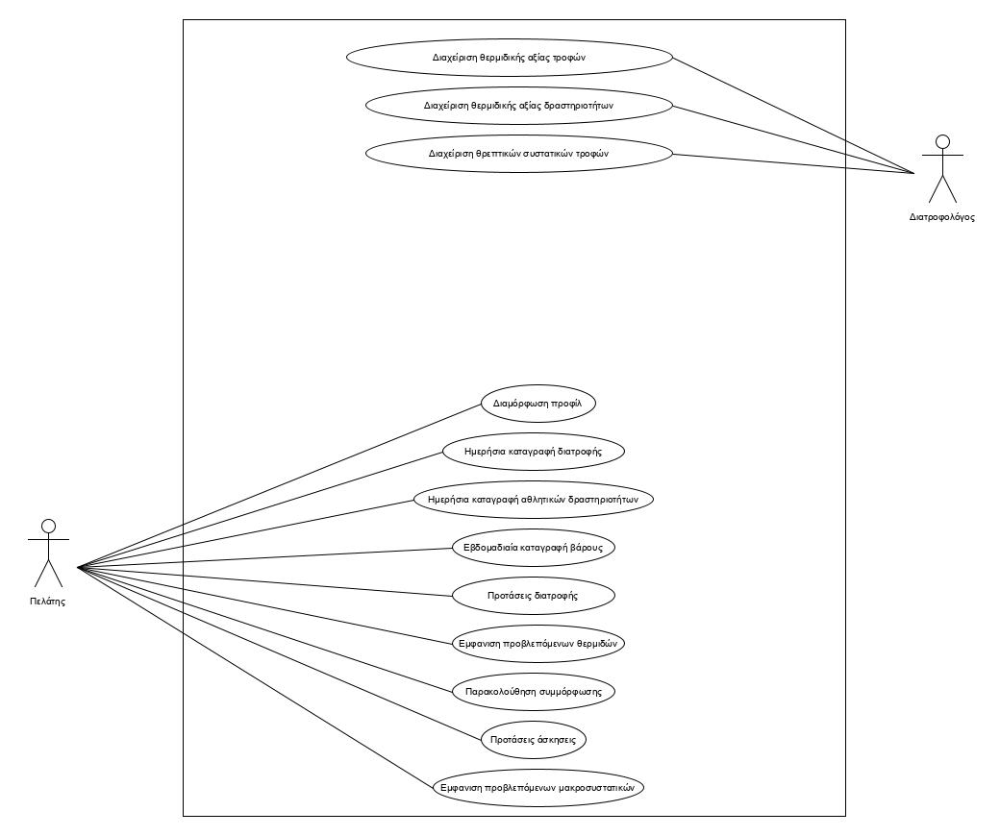

# Εισαγωγή 💭

Το έγγραφο αυτό περιέχει τις απαιτήσεις του παρόντος συστήματος καθώς και μια αναλυτική παρουσίαση των δυνατοτήτων του. Επίσης περιέχει  επεξήγηση των περιπτώσεων χρήσης του καθώς και υποθέσεις και εξαρτήσεις, απαραίτητες για την υλοποίηση του. Επιπρόσθετα περιλαμβάνεται μια σύνοψη των ειδικών απαιτήσεων του συστήματος, συμπληρωματικές προδιαγραφές όπως οι μη λειτουργικές απαιτήσεις καθώς και περιορισμούς σχεδίασης και υλοποίησης. Στην παράγραφο "Επισκόπηση" περιλαμβάνεται οδηγός των περιεχόμενων του εγγράφου.

## Εμβέλεια

\[*Περιγράφουμε τι θα κάνει και κυρίως τι δεν θα κάνει το λογισμικό. Βλέπε παράδειγμα 3-2 του βιβλίου στη σελίδα 139.*

*Ένα διάγραμμα περιβάλλοντος (πρωταρχικό διάγραμμα ροής δεδομένων) που βοηθά στην κατανόηση του συστήματος σε σχέση με το περιβάλλον του. Βλέπε το σχήμα 4-12 του παραδείγματος 4-1 στη σελίδα 185 του βιβλίου*\]

## Ορισμοί ακρώνυμα και συντομογραφίες

\[*Ένας πίνακας ακρωνύμων και συντομογραφιών που χρησιμοποιούνται στο έγγραφο. Ένας δεύτερος πίνακας με ορισμούς. Οι ορισμοί λαμβάνονται από το γλωσσάρι αν αυτό υπάρχει. Βλέπε πίνακα 3-5 του παραδείγματος 3-1 στη σελίδα 134.*\]

## Αναφορές

* [ ] [Έγγραφο αναφοράς διατροφολογίας](Nutrition-Data/Nutrition.pdf)
* [ ] [Σημείο αναφοράς υπολογισμού θερμιδικής άξιας τροφών](https://www.everydayhealth.com/g00/calorie-counter/?i10c.ua=1&i10c.encReferrer=&i10c.dv=11)

## Επισκόπηση

# Συνολική περιγραφή

## Επισκόπηση μοντέλου περιπτώσεων χρήσης ⚽

* [ ] Υποβολή διατροφικών και αθλητικών δεδομένων απο τον διατροφολόγο.
* [ ] Εισαγωγή χαρακτηρηστικών. Όπως:
    * [ ] Βάρος.
    * [ ] Ύψος
    * [ ] Ηλικία
    * [ ] Φύλο
* [ ] Δυνατότητα εισαγωγής διατροφικών στόχων. Όπως:
    * [ ] Διατήρηση βάρους.
    * [ ] Απώλεια βάρους 0.5kg/1kg ανά εβδομάδα.
    * [ ] Λήψη βάρους 0.5kg/1kg ανά εβδομάδα.    
* [ ] Δυνατότητα εισαγωγής τύπου δραστηριότητας. Όπως:
    * [ ] Ημερίσια.
    * [ ] Εβδομαδιαία.
    * [ ] Μηνιαία. 
    * [ ] Και άλλα.
* [ ] Εμφάνιση προβλεπόμενων θερμιδών προς κατανάλωση με βάση τα χαρακτηρηστικά του πελάτη.
* [ ] Δυνατότητα εισαγωγής καταναλωμένων τροφων και πραγματοποιημένων δραστηριοτήτων από τον πελάτη.
* [ ] Δυνατότητα καταγραφής βάρους σε εβδομαδιαία βάση.
* [ ] Δυνατότητα εισαγωγής ανεπιθύμητων τροφών από τον πελάτη.
* [ ] Δυνατότητα εμφάνισης προτεινόμενων τροφών για τις ανάγκες του πελάτη.
* [ ] Δυνατότητα παρακολούθησης της προόδου του πελάτη σε σχέση με τους στόχους του.
* [ ] Δυνατότητα παραγωγής εβδομαδιαίων στατιστικών με απόκλιση από τους στόχους του.

### 

 

## Υποθέσεις και εξαρτήσεις

\[*Γράφουμε τις υποθέσεις που κάνουμε και τις εξαρτήσεις του συστήματος σε σχέση με το περιβάλλον του.*\]

# Ειδικές Απαιτήσεις 

## Περιπτώσεις χρήσης

### Οι ενδιαφερόμενοι και οι ανάγκες τους

\[*Ένας πίνακας των ενδιαφερομένων (stakeholders) με τις ανάγκες τους. Βλέπε πίνακα 3-6 του παραδείγματος 3-2 στη σελίδα 138 του βιβλίου.*\]

### Actors του συστήματος

| Actors | Περιγραφή |
| :----------------------| :---------|
| Διατροφολόγος | text
| Χρήστης | text

\[*Ένα πίνακας με του actors του συστήματος. Βλέπε πίνακας 3-7 παραδείγματος 3-11 στη σελίδα 167 του βιβλίου.*\]

### Περιγραφές περιπτώσεων χρήσης

#### [ΠΧ1 Δημιουργία προφίλ χρήστη](uc1-profile-creation.md)

#### [ΠΧ2 Διαχείριση τροφών](uc2-callorie-foods-administration.md)

#### [ΠΧ3 Διαχείριση δραστηριοτήτων](uc3-callorie-sports-administration.md)

#### [ΠΧ4 Έκδοση κάρτας ανάληψης](uc4.md)

#### ΠΧ5 Ανατοκισμός

#### ΠΧ6 Συναλλαγή από ΑΤΜ

#### ΠΧ7 Ταυτοποίηση Χρήστη

## Συμπληρωματικές προδιαγραφές

\[*Οι επόμενες ενότητες περιέχουν όλες τις μη λειτουργικές απαιτήσεις και τους περιορισμούς σχεδίασης και υλοποίησης.*\]

### Απαιτήσεις διεπαφών

#### Διεπαφές χρήστη

| Table | Περιγραφή |
| :----------------------| :---------|
| input | text

\[*Βλέπε πίνακα 5-2 του παραδείγματος 5-1 στη σελίδα 305*\]

#### Διεπαφές υλικού

| Table | Περιγραφή |
| :----------------------| :---------|
| input | text

\[*Βλέπε πίνακα 5-2 του παραδείγματος 5-1 στη σελίδα 305*\]

#### Διεπαφές επικοινωνίας

| Table | Περιγραφή |
| :----------------------| :---------|
| input | text

\[*Βλέπε πίνακα 5-2 του παραδείγματος 5-1 στη σελίδα 305*\]

#### Διεπαφές λογισμικού

| Table | Περιγραφή |
| :----------------------| :---------|
| input | text

\[*Βλέπε πίνακα 5-2 του παραδείγματος 5-1 στη σελίδα 305*\]

### Περιορισμοί σχεδίασης και υλοποίησης

| Table | Περιγραφή |
| :----------------------| :---------|
| input | text

\[*Βλέπε πίνακα 5-3 του παραδείγματος 5-1 στη σελίδα 305*\]

### Ποιοτικά χαρακτηριστικά

#### Απόδοση

| Table | Περιγραφή |
| :----------------------| :---------|
| input | text

\[*Βλέπε πίνακα 5-4 του παραδείγματος 5-1 στη σελίδα 306*\]

#### Διαθεσιμότητα

| Table | Περιγραφή |
| :----------------------| :---------|
| input | text

\[*Βλέπε πίνακα 5-4 του παραδείγματος 5-1 στη σελίδα 306*\]

#### Ασφάλεια

| Table | Περιγραφή |
| :----------------------| :---------|
| input | text

\[*Βλέπε πίνακα 5-4 του παραδείγματος 5-1 στη σελίδα 306*\]

#### Ευελιξία

| Table | Περιγραφή |
| :----------------------| :---------|
| input | text

\[*Βλέπε πίνακα 5-4 του παραδείγματος 5-1 στη σελίδα 306*\]

#### Ευχρηστία

| Table | Περιγραφή |
| :----------------------| :---------|
| input | text

\[*Βλέπε πίνακα 5-4 του παραδείγματος 5-1 στη σελίδα 306*\]

# Υποστηρικτικό υλικό

## Μοντέλο πεδίου

\[*Εισάγουμε το μοντέλο πεδίου του συστήματος. Βλέπε σχήμα 4-100 του παραδείγματος 4-13 στη σελίδα 251 του βιβλίου*\]

## Ανάλυση περιπτώσεων χρήσης
--------------------------

### Κλάσεις ανάλυσης

\[*Εισάγουμε ένα διάγραμμα κλάσεων με την αρχική έκδοση των κλάσεων λογισμικού. Βλέπε σχήμα 4-104 του παραδείγματος 4-14 στη σελίδα 258 του βιβλίου*\]

### Συμπεριφορές

\[*Για κάθε σημαντική περίπτωση χρήσης εισάγουμε ένα διάγραμμα κλάσεων με τις κλάσεις που συμμετέχουν στη συμπεριφορά του συστήματος για την περίπτωση χρήσης. Το σημαντικότερο όμως είναι ένα διάγραμμα επικοινωνίας ή ακολουθίας που δείχνει την ανταλλαγή μηνυμάτων.*

*Βλέπε το παράδειγμα 4-16 στη σελίδα 262 του βιβλίου*\]

#### Άνοιγμα νέου λογαριασμού

## Άλλα μοντέλα
------------

\[*Άλλα μοντέλα όπως για παράδειγμα διαγράμματα μηχανής καταστάσεων, πίνακες απόφασης κλπ. Βλέπε παράδειγμα 4-6 του βιβλίου*\]

## Επιχειρησιακοί κανόνες

\[*Ένας πίνακας με του επιχειρησιακούς κανόνες. Βλέπε πίνακα 3-4 του παραδείγματος 3-1 στη σελίδας 133 του βιβλίου.*\]

| Επιχειρησιακοί κανόνες | Περιγραφή |
| :----------------------| :---------|
| ΕΚ1 | O Αριθμός Δελτίου Ταυτότητας και το ΑΦΜ είναι μοναδικά για κάθε πελάτη 
| ΕΚ2 | Όλα τα στοιχεία του πελάτη είναι υποχρεωτικά, με εξαίρεση τον αριθμό Fax
| ΕΚ3 | Η ηλικία του πελάτη θα πρέπει να είναι μεγαλύτερη των 18 ετών
